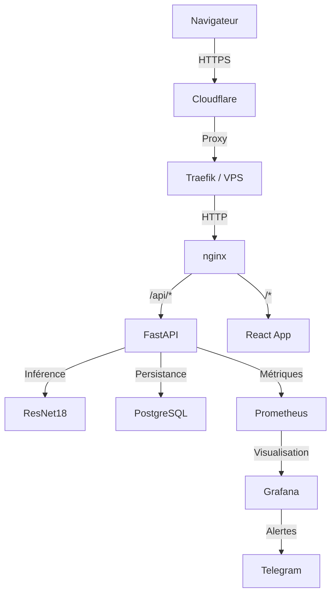
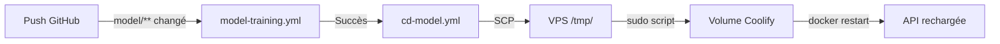

# Architecture WasteLens

## Vue d'ensemble

Diagramme Mermaid du flux de données complet :

## Flux d'une prédiction
1. Utilisateur upload une image
2. nginx proxifie vers FastAPI
3. FastAPI valide (magic bytes, taille, JWT)
4. ResNet18 classifie l'image
5. Résultat sauvegardé en PostgreSQL
6. Métrique incrémentée dans Prometheus
7. Réponse retournée au frontend

## Flux MLOps

## Stack technique
| Composant | Technologie | Version |
|---|---|---|
| API | FastAPI + Python | 3.13 |
| Frontend | React + Vite | 18 |
| Modèle | ResNet18 PyTorch | CPU-only |
| DB | PostgreSQL | 18 |
| Monitoring | Prometheus + Grafana | 10.4.0 |
| Déploiement | Docker + Coolify | - |
| Proxy | nginx + Traefik | - |
