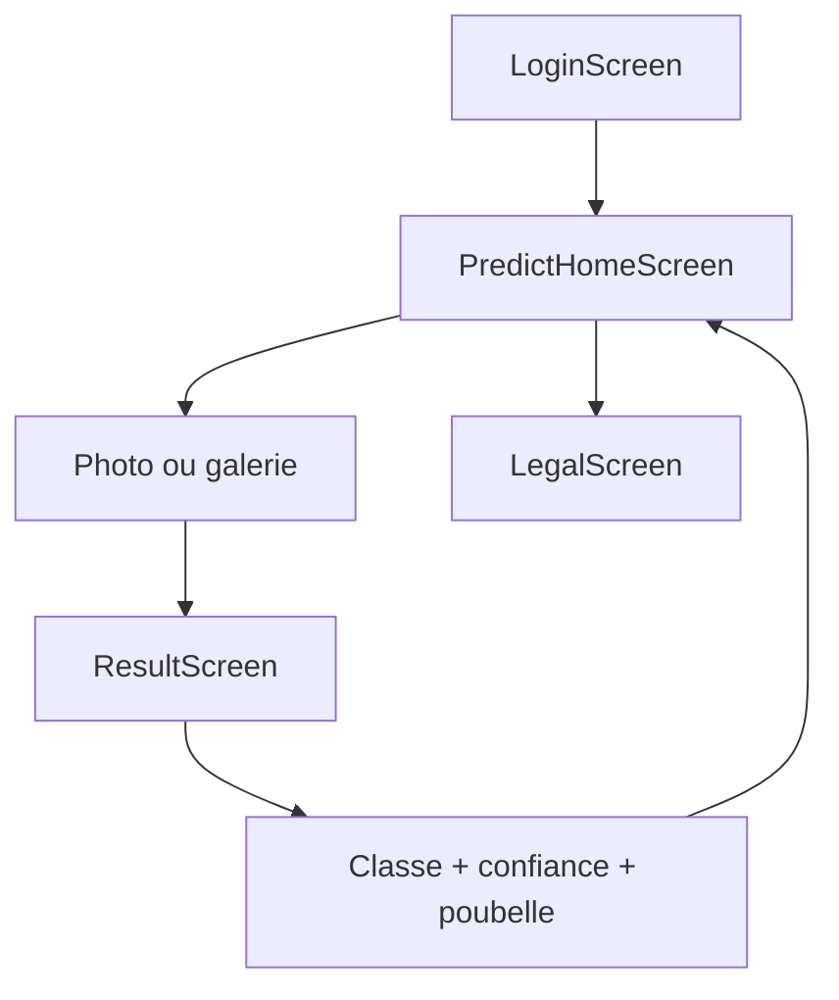
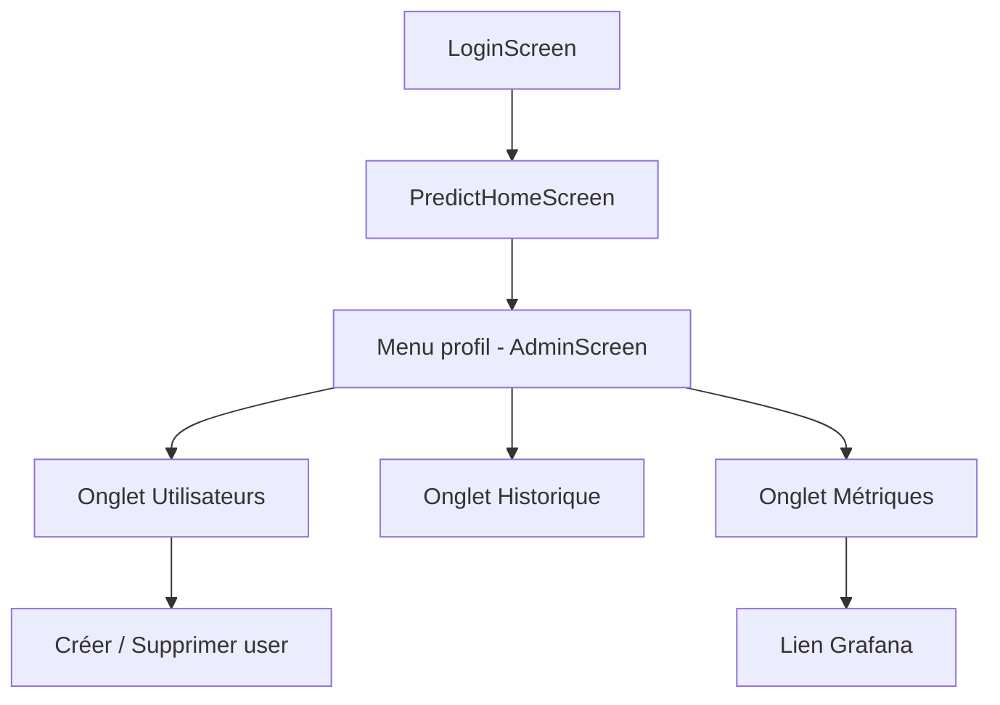

# User Stories WasteLens

---

**US-01** — En tant qu'utilisateur, je veux me connecter avec mon identifiant et mot de passe afin d'accéder à l'application de manière sécurisée.

Critères d'acceptation :
- [ ] `POST /login` retourne un JWT valide avec `access_token` et `expires_in`
- [ ] Un mauvais identifiant ou mot de passe retourne HTTP 401
- [ ] Plus de 5 tentatives en 1 minute retourne HTTP 429 (rate limiting)
- [ ] Accessibilité : le formulaire de connexion est navigable au clavier, les champs ont des labels explicites liés par `htmlFor`

---

**US-02** — En tant qu'utilisateur connecté, je veux uploader une photo de déchet afin d'obtenir instantanément sa catégorie et la recommandation de tri correspondante.

Critères d'acceptation :
- [ ] `POST /predict` accepte JPEG et PNG jusqu'à 10 MB
- [ ] La réponse contient `predicted_class`, `confidence` et `bin_recommendation`
- [ ] Un fichier non-image (ex. PDF) retourne HTTP 400
- [ ] Un fichier > 10 MB retourne HTTP 413
- [ ] La prédiction est persistée en base (table `predictions`)
- [ ] Accessibilité : le résultat de classification est annoncé via `aria-live`, le score de confiance est affiché en texte (pas uniquement en couleur)

---

**US-03** — En tant qu'utilisateur connecté, je veux consulter l'historique de mes prédictions afin de suivre mes classements passés.

Critères d'acceptation :
- [ ] `GET /history/me` retourne la liste paginée des prédictions de l'utilisateur connecté uniquement
- [ ] Chaque entrée affiche la classe détectée, le score de confiance et l'horodatage
- [ ] Un utilisateur ne peut pas accéder aux prédictions d'un autre utilisateur (HTTP 403)
- [ ] Accessibilité : le tableau d'historique a des en-têtes de colonnes `<th scope="col">`

---

**US-04** — En tant qu'utilisateur connecté, je veux me déconnecter afin de sécuriser ma session sur un appareil partagé.

Critères d'acceptation :
- [ ] La déconnexion supprime le JWT du `localStorage`
- [ ] Après déconnexion, toute requête authentifiée retourne HTTP 401
- [ ] L'utilisateur est redirigé vers l'écran de connexion
- [ ] Accessibilité : le bouton de déconnexion est accessible au clavier et a un `aria-label` explicite

---

**US-05** — En tant qu'administrateur, je veux créer un nouvel utilisateur afin de lui donner accès à l'application sans qu'il s'inscrive lui-même.

Critères d'acceptation :
- [ ] `POST /users` crée un utilisateur avec `username`, `password` (hashé bcrypt rounds=12) et `role`
- [ ] Un username déjà existant retourne HTTP 409
- [ ] Seul un token avec `role=admin` peut accéder à cet endpoint (HTTP 403 sinon)
- [ ] L'utilisateur créé apparaît immédiatement dans la liste admin

---

**US-06** — En tant qu'administrateur, je veux supprimer un utilisateur afin de révoquer son accès et effacer ses données conformément au RGPD.

Critères d'acceptation :
- [ ] `DELETE /users/{user_id}` supprime l'utilisateur et ses prédictions en cascade
- [ ] Un admin ne peut pas supprimer son propre compte (HTTP 403)
- [ ] Un `user_id` inexistant retourne HTTP 404
- [ ] Seul un token avec `role=admin` peut accéder à cet endpoint

---

**US-07** — En tant qu'administrateur, je veux consulter l'historique global de toutes les prédictions afin de surveiller l'utilisation de l'application.

Critères d'acceptation :
- [ ] `GET /history` retourne toutes les prédictions paginées (`skip`, `limit`)
- [ ] Filtrage optionnel par `user_id` via query parameter
- [ ] Seul un token avec `role=admin` peut accéder à cet endpoint (HTTP 403 sinon)
- [ ] La réponse inclut le total pour la pagination

---

**US-08** — En tant qu'administrateur, je veux consulter les métriques de performance du modèle afin de détecter une dégradation de la classification.

Critères d'acceptation :
- [ ] `GET /reports/evaluation` retourne le rapport JSON (accuracy, précision par classe)
- [ ] `GET /reports/confusion-matrix` retourne l'image PNG de la matrice de confusion
- [ ] Les deux endpoints requièrent un JWT valide (HTTP 401 sinon)
- [ ] Si les fichiers de rapport sont absents, retourne HTTP 404
- [ ] Accessibilité : la matrice de confusion a un attribut `alt` descriptif côté frontend

---

## Parcours utilisateurs

### Parcours agent (rôle user)

### Parcours administrateur (rôle admin)

